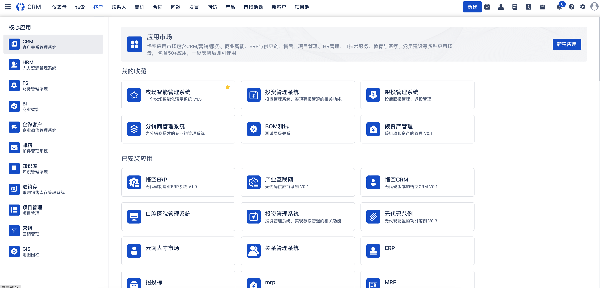
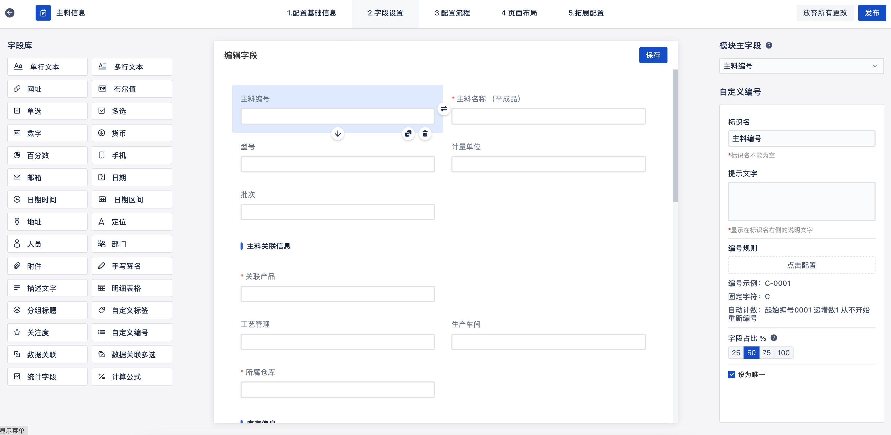
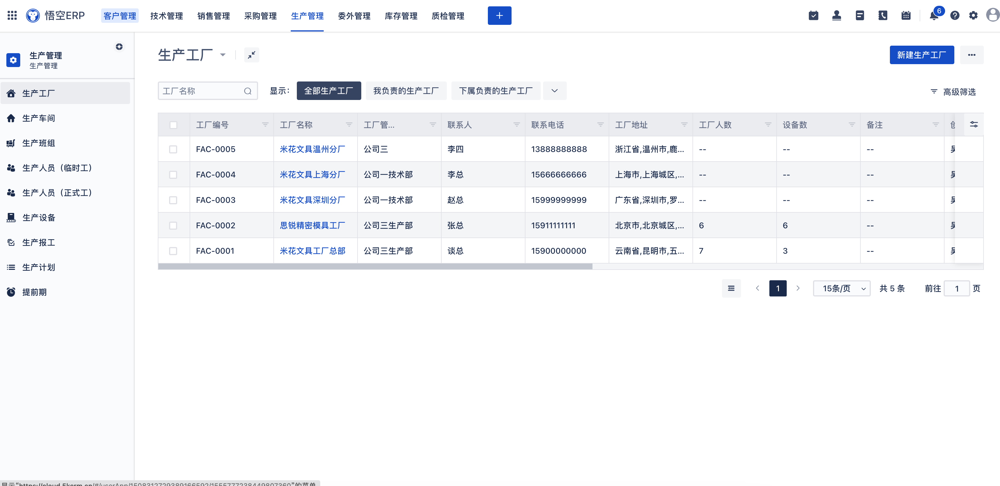
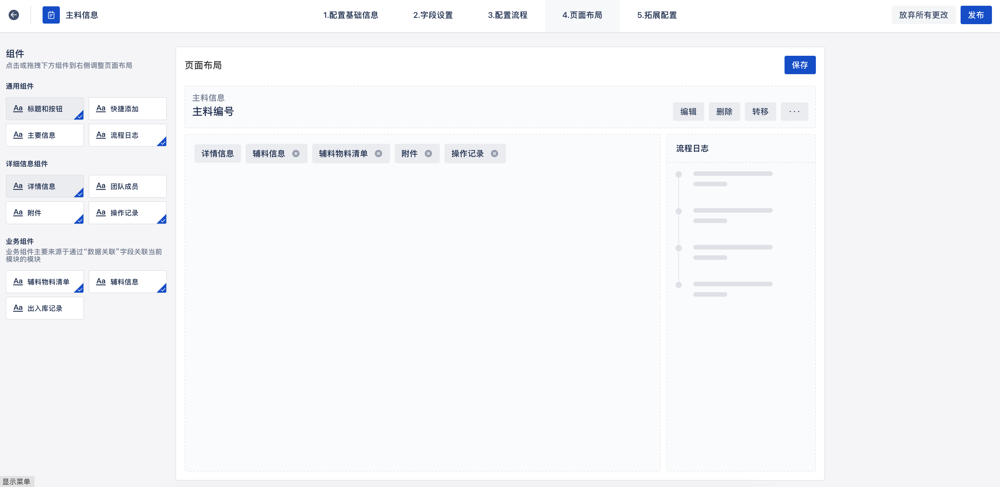
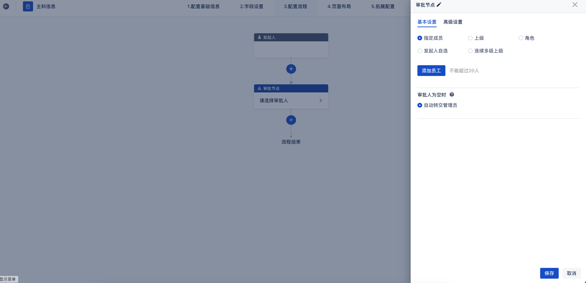

# 悟空无代码平台


体验地址：[https://www.72crm.com](http://www.72crm.com)

## 悟空无代码平台介绍


悟空无代码平台正式开源，通过悟空无代码平台开发工具，企业可自主地快速开发出适合企业需要的信息化系统，开发过程只需要业务人员参与，开发效率极高，维护性很强。

开发人员可以通过无码的形式，在可视化设计器中，用鼠标拖拽和点选的开发方式，快速搭建企业应用软件。开发人员利用开发平台，可以跳过基础架构，直接进入与业务需求相关的工作。

悟空无代码平台与传统的通过代码的开发方式相比，这种面向业务的开发方式，开发迅速，调整极快，能够快速适应企业需求，也能够快速应对企业变化。


官网地址：[http://www.5kcrm.com](http://www.5kcrm.com/)


QQ群交流群群：[259359511](https://qm.qq.com/cgi-bin/qm/qr?k=G9T2audQqbZBR_HG0aTP9E-8fE7oMeb8&jump_from=webapi)


扫码添加小悟官方客服微信，邀您加入千人微信交流群：


关注悟空CRM公众号，了解更多悟空资讯


 :boom:  :boom:  :boom: 注：悟空无代码平台采用全新的前后端分离模式，本仓库代码中已集成前端vue打包后文件，  **可免去打包操作，无需运行前端** 


## 悟空CRM目录结构

``` lua
wk_modules
├── module        -- 无代码模块
├── common        -- 基础模块(暂时无用)
```

### 核心功能模块

 **字段组件丰富：** 支持多行文本、网址、数字、下拉列表、百分比、时间、多选等丰富控件<br/>
 **布局样式多样：** 可调整表单内容大小与形式、平铺或下拉等格式，满足表单元素多样化。<br/>
 **跨应用关联：** 不同应用之间数据关联以实现跨应用数据调取，同时支持对不同应用数据间的筛选与聚合。<br/>
 **多维权限设置：** 对于表单内容，可对其权限设为必填、设为唯一或选择隐藏。<br/>
 **节点类型多样：** 审批节点、填写节点、抄送节点等，根据节点任务选择对应类型。<br/>
 **分支规则设定：** 数据筛选标准的数据才能进入对应的分支，实现对数据的筛选与分流。<br/>
 **节点权限控制：** 不同应用之间数据关联以实现跨应用数据调取。<br/>
 **操作简单灵活：** 通过拖拽方式，将各类组件进行添加<br/>
 **支持多元组件：** 丰富多样的组件库，按需整合信息。筛选/文本/报表等多种组件<br/><br/>
 **多类型图标样式：** 数据表、汇总表、指标卡等数十种图标类型，涵盖广泛的应用场景。<br/>


## 悟空无代码平台使用的主要技术栈

|名称                 | 版本                     | 说明   |
|---------------------|---------------------------|----  |
| spring-cloud-alibaba| 2021.0.4                  |  核心框架  |
| spring-boot         | 2.6.11                    |  spring版本  |
| mybatis-plus        | 3.5.2                     |  ORM框架  |
| nacos               | 2.1.0                     |  注册中心以及配置管理  |
| seata               | 1.2.0                     |  分布式事务 |
| elasticsearch       | 7.15.2                    |  搜索引擎中间件  |
| jetcache            | 2.7.1                     |  分布式缓存框架  |
| feign               | 3.1.4                     |  服务调用        |
| rocketmq            | 4.9.4                     |  消息队列        |


## 使用说明

### 一、前置环境
- Jdk1.8
- Maven3.5^   
- Mysql5.7^
- Redis(版本不限)
- Elasticsearch 7.15.2
- Nacos（1.4^)
- RocketMq（4.9.4)

### 安装

安装说明：[安装说明](https://gitee.com/wukongcrm_admin/wukong-nocode/wikis/%E5%AE%89%E8%A3%85%E8%AF%B4%E6%98%8E)


### 三、其他说明

#### 1.接口文档<br/>

```
接口文档地址：http://localhost:46923/doc.html
```
#### 2.docker镜像<br/>
```
敬请期待
```
### 四、悟空无代码平台功能模块预览





